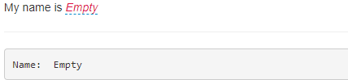

# shinyEditable

`shinyEditable` package is an R wrapper for [`X-editable`](https://github.com/vitalets/x-editable) javascript library. You can use it to create in-place editable input elements.

## Installation

You can install the released version of shinyEditable from [CRAN](https://CRAN.R-project.org) with:

``` r
## CRAN version not available
```
or the development version from github with:

``` r
devtools::install_github("yang-tang/shinyEditable")
```

## Example

This is a basic example which shows you how to solve a common problem:

``` r
library(shiny)
library(shinyEditable)

ui <- fluidPage(
  "My name is ", editableInput("name", "text", ""),
  hr(),
  verbatimTextOutput("bar")
)

server <- function(input, output, session) {
  output$bar <- renderPrint({
    cat("Name: ", input$name)
  })
}

shinyApp(ui, server)
```


